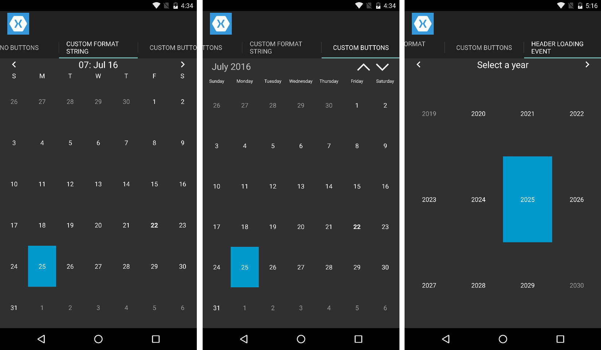

Calendar Custom Header
=====================

This sample demonstrates the different ways that you can customize the header of Xuni Calendar.

Xuni Calendar supports three different view modes (month, year, and decade). By default, the calendar displays general month/year formats that should satisfy most users but there are specific scenarios where you may want to customize the header content. The four sample calendars in this project show how to:

1. Hide the buttons only by setting ShowNavigationButtons = False
2. Format just the month header text by setting HeaderMonthFormat.
3. Format month, year and decade header text within the HeaderLoading event.
4. Create a completely custom header, with optional buttons, by setting ShowHeader = False and reconstructing the header parts however you want in XAML/C#.

