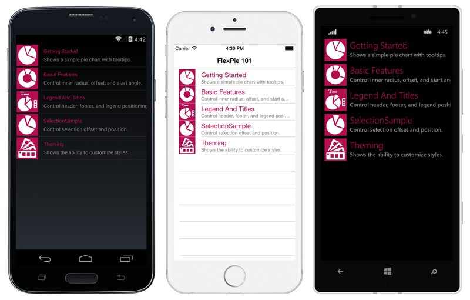

FlexPie 101
===========

The FlexPie control allows you to create customized pie charts that represent a series as slices of a pie, wherein the arc length of each slice depicts the value represented by that slice. These charts are commonly used to display proportional data such as percentage cover. The multi-colored slices make pie charts easy to understand and usually the value represented by each slice is displayed with the help of labels.

