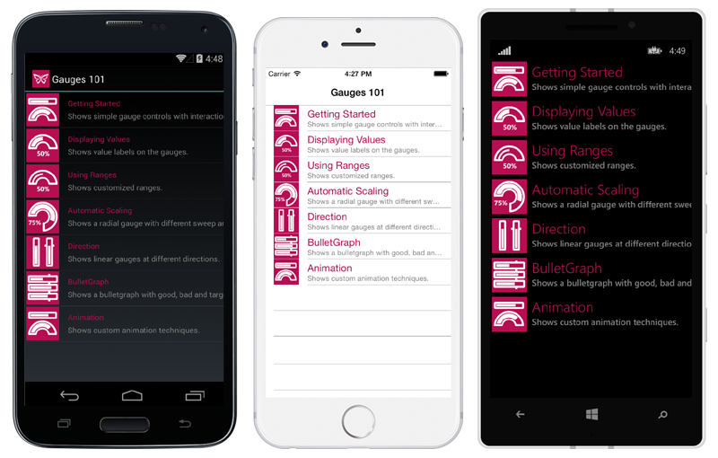

Gauges 101
==========

The Gauge controls allow you to display information in a dynamic and unique way by delivering the exact graphical representation you require. Gauges are better than simple labels because they also display a range, allowing users to determine instantly whether the current value is low, high, or intermediate. 

